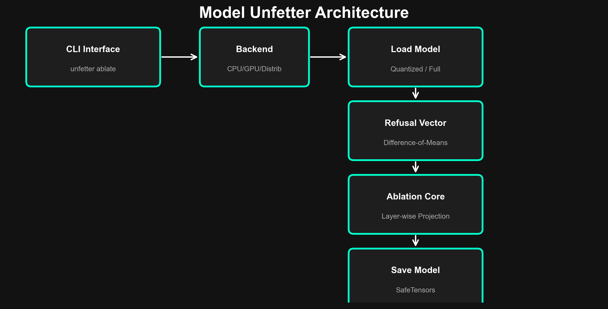
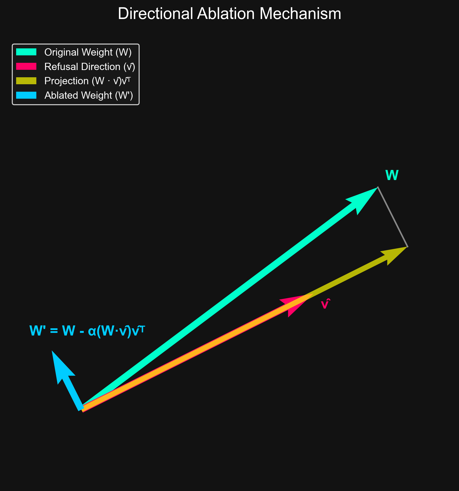

# 🔓 Model Unfetter

**Multi-tier model unalignment framework using directional ablation**

[](https://opensource.org/licenses/Apache-2.0)
[](https://www.python.org/downloads/)
[](https://pytorch.org/)

> ⚠️ **Disclaimer:** This tool is designed exclusively for AI safety research and red teaming. Use responsibly and in compliance with all applicable laws and model licenses.

## Overview

Model Unfetter removes refusal behaviors from language models using **directional ablation** — a technique that identifies and removes the linear directions in weight space responsible for refusal, while preserving the model's general capabilities.

### How It Works






### Core Formula

```
W' = W - α × (W · v̂) ⊗ v̂ᵀ
```

Where `W` is a weight matrix, `v̂` is the normalized refusal direction, and `α` controls ablation strength.

## Features

- **Multi-Backend Architecture**: CPU (4-bit, 16GB RAM), GPU (8/16/24GB VRAM), and multi-GPU distributed processing
- **Smart Layer Selection**: Auto-targets the last 30% of layers where refusal is concentrated, or manual override with slices/ranges/percentages
- **Universal Compatibility**: Auto-detects architecture for *any* HuggingFace model via smart heuristics (or verifies with `--verify`)
- **Optimized Handlers**: 15+ dedicated family handlers (Llama, Mistral, Mixtral, Gemma, Qwen, Phi, etc.)
- **Refusal Vector Computation**: Difference-of-means with caching, batched extraction, and custom prompt support
- **Quality Validation**: Built-in refusal rate, helpfulness, KL divergence, and knowledge retention benchmarks
- **Resume Support**: Checkpoint system for long-running jobs on limited hardware
- **Flexible I/O**: SafeTensors and PyTorch output formats

## Quick Start

```bash
# Install
pip install -e .

# For GPU support
pip install -e ".[gpu]"

# For full features
pip install -e ".[full]"
```

### Basic Usage

```bash
# Auto-detect hardware and ablate
unfetter ablate meta-llama/Llama-3.1-8B-Instruct

# Universal Support (Any HuggingFace Model)
unfetter ablate my-custom-model --verify  # Check detected architecture
unfetter ablate my-custom-model           # Run with auto-fallback

# Custom strength and layers
unfetter ablate ./my-model --strength 0.8 --layers -8:-1

# CPU mode for limited hardware
unfetter ablate large-model --backend cpu --ram 16

# With validation
unfetter ablate model-name --validate

# Compare original vs ablated
unfetter compare original-model ./ablated-output

# System info
unfetter info
```

### Python API

```python
from unfetter.backends.auto import select_backend
from unfetter.core.vectors import compute_refusal_vector
from unfetter.core.ablation import directional_ablation
from unfetter.core.layers import auto_select_layers
from unfetter.datasets.loader import load_prompts

# Load model with optimal backend
backend = select_backend("auto")
model, tokenizer = backend.load_model("meta-llama/Llama-3.1-8B-Instruct")

# Compute refusal direction
refusal, compliance = load_prompts("builtin")
vector = compute_refusal_vector(model, tokenizer, refusal, compliance)

# Ablate
layers = auto_select_layers(model.config.num_hidden_layers)
results = directional_ablation(model, vector, layers, strength=1.0)

# Save
backend.save_model(model, tokenizer, "./unfettered-output")
```

## Architecture

```
unfetter/
├── core/           # Ablation algorithm, vector computation, quantization
│   ├── ablation.py     # Directional ablation: W' = W - α(W·v̂)v̂ᵀ
│   ├── vectors.py      # Refusal vector via difference-of-means
│   ├── quantization.py # 4-bit/8-bit loading with dtype fallback
│   ├── layers.py       # Layer selection (auto, slices, percentages)
│   └── validation.py   # Refusal rate, helpfulness, KL divergence
├── backends/       # Hardware-optimized processing
│   ├── cpu_backend.py    # 4-bit, sequential, checkpointing
│   ├── gpu_backend.py    # Auto-quant by VRAM, batch processing
│   ├── distributed.py   # Multi-GPU with device-aware ablation
│   └── auto.py          # Hardware detection & backend selection
├── models/         # Architecture-specific handlers
│   ├── llama.py, mistral.py, gemma.py
│   └── registry.py     # Auto-detection for 15+ families
├── datasets/       # Prompt pairs (100 built-in per category)
├── cli/            # Click-based CLI (unfetter ablate/resume/compare/validate/info)
├── benchmarks/     # Refusal, quality, jailbreak, comparison tests
└── utils/          # Device detection, checkpointing, logging
```

## Hardware Requirements

| Backend | Min RAM/VRAM | Quantization | Speed |
|---------|-------------|--------------|-------|
| CPU | 16GB RAM | 4-bit NF4 | ~10 min/7B |
| GPU (8GB) | 8GB VRAM | 4-bit NF4 | ~2 min/7B |
| GPU (16GB) | 16GB VRAM | 8-bit | ~1 min/7B |
| GPU (24GB+) | 24GB VRAM | fp16 | ~30 sec/7B |
| Multi-GPU | 2×16GB+ | fp16 | ~15 sec/7B |

## Troubleshooting

### Common Issues

- **CUDA Out of Memory**: Try reducing `--batch-size` (if exposed) or use `--quantization 4bit`.
- **Refusal Vector Not Cached**: Ensure you have write permissions to `~/.unfetter`.
- **Model Not Found**: Check if the model ID is correct on HuggingFace or if the local path exists.

### Support

For bugs and feature requests, please open an issue on the GitHub repository.

##Model Unfetter compared to closest tools

While inspired by research scripts like *Heretic*, **Model Unfetter** is built as a production-grade engine designed for accessibility and safety.

| Feature | **Model Unfetter** | **Heretic / Scripts** | **Impact** |
| :--- | :--- | :--- | :--- |
| **Backend** | **CPU + GPU + Distributed** | GPU Only | Run ablation on a MacBook or consumer PC. No H100s required. |
| **Precision** | **4-bit NF4** (Built-in) | FP16 / 8-bit | Requires **50% less VRAM** to load the same model. |
| **Architecture** | **Modular Package** | Single Script | Installable via `pip`. Importable into other tools. |
| **Safety** | **Validation Suite** | None | Automatically tests if the model is broken before saving. |
| **Resumability**| **Checkpointing** | No | Resume from the last layer if your process crashes. |


## License

Apache License 2.0 — see [LICENSE](LICENSE) for details.
